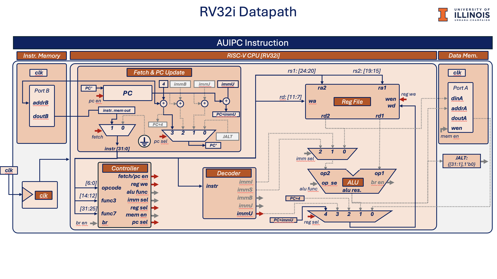
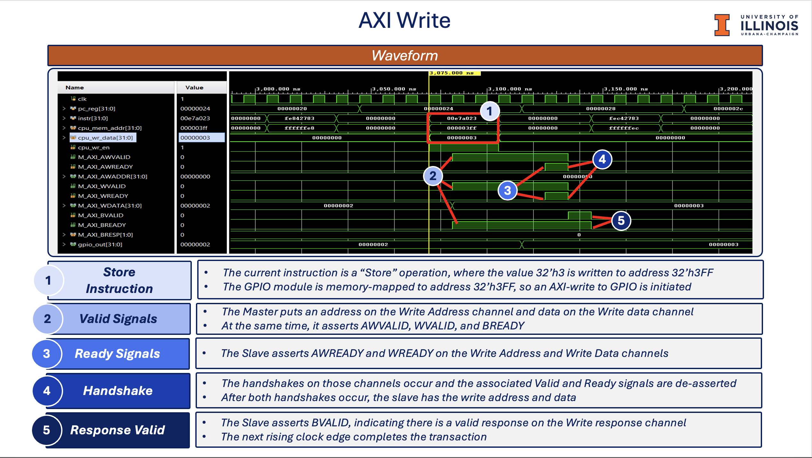
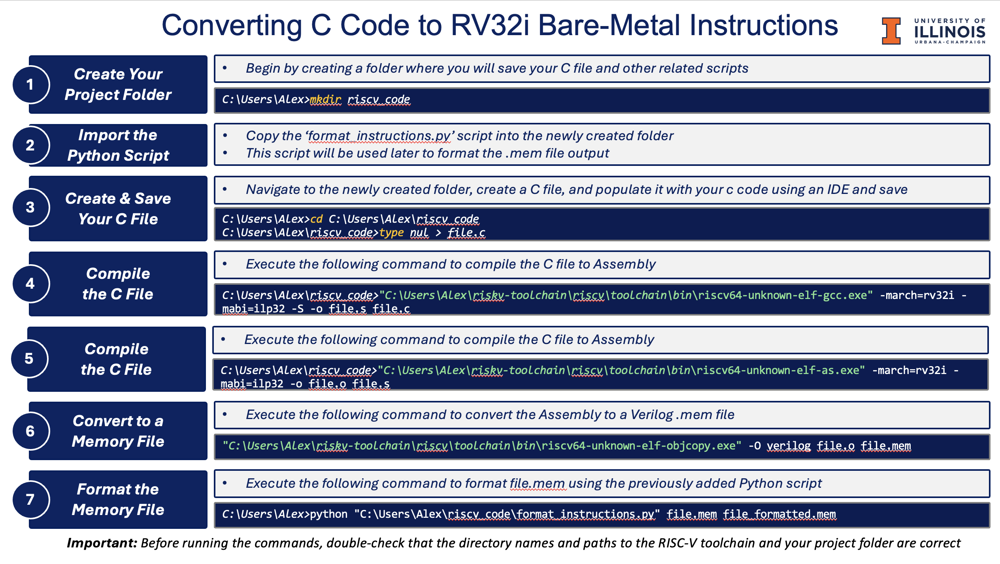

# RISC-V RV32I CPU with Multicycle Design and AXI Interface on FPGA

This project implements a 32-bit RISC-V CPU using the RV32I instruction set. The CPU uses a multicycle design for efficient resource use and is deployed on a Xilinx Spartan FPGA. An AXI master interface is added to enable communication with peripheral hardware. For more details, refer to the PDF slide deck, which covers the RISC-V datapath, AXI timing, and setup instructions for the RISC-V toolchain.

## Project Overview

### 1. Create RV32I CPU with Multicycle Design

*RV32i Datapath*

### 2. Add AXI Master for Communication with Hardware Peripherals

*AXI Protocol*

### 3. RISC-V Toolchain Installation on Windows

*RISC-V Toolchain*

## Additional Resources

For a deeper dive into each component, including RISC-V datapath details, AXI interface timing diagrams, and comprehensive installation instructions for the RISC-V toolchain, refer to the **PDF slide deck** provided in the project repository.
